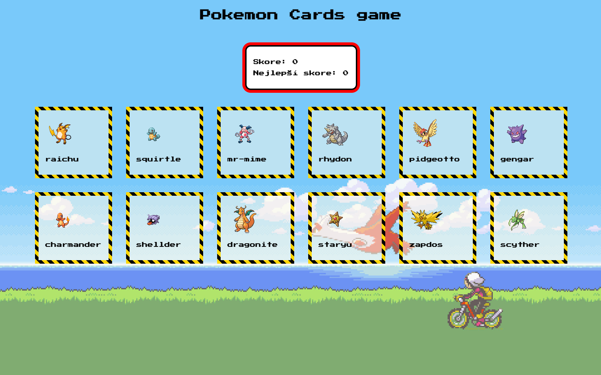

# Pokemon Memory Card Game

This game was created according to the assignment from [The Odin Project](https://www.theodinproject.com/lessons/node-path-react-new-memory-card)
 

[Live project](pokemon-memory-nine.vercel.app)

## Techstack 
* React
* Vite
* SCSS
* [Pokemon REST API](https://pokeapi.co/)

## How to install and run this project
Make sure you have [Node.js](https://nodejs.org/) installed.

1. Clone this repository
2. Install dependencies: 
`npm install`
3. Start the development server: 
`npm run dev`

made by [Michael Ptáček](https://michaelptacek.com)
